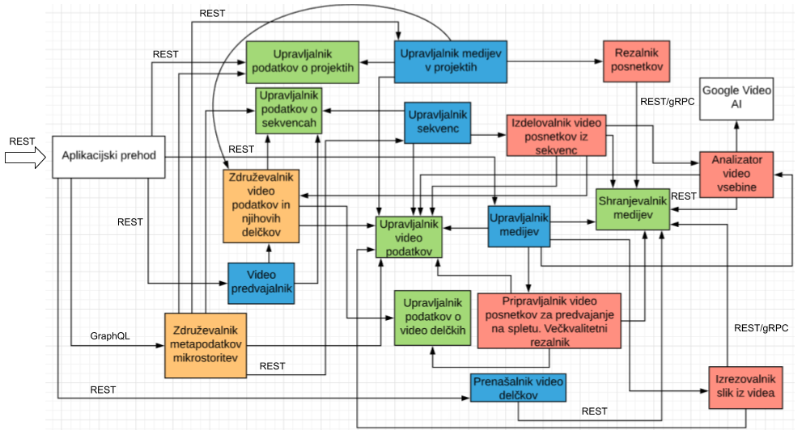
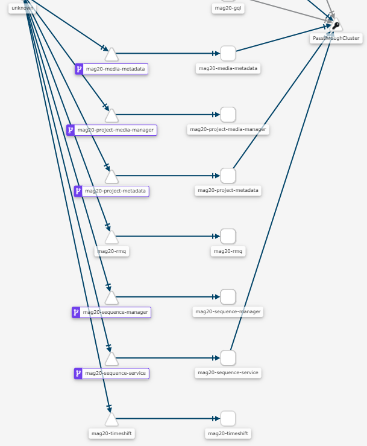

# DOCUMENTATION
All utility, Kubernetes, Docker, http requests, gRPC protobuf files 

## Description
App for my master thesis. Go inside``` k8s``` direcotry  for Kuberntes installation. Go inside ```docker``` directory for docker-compose local run.  To test HTTP request install Insomnia client and import``` .json``` file from http directory. To test ``` gRPC ``` request install BloomRPC clinet and import protobuf files from ```grpc``` directory.  

* GUI app is available at : https://mag-gui-ftwvx7w2dq-ez.a.run.app/  (not working anymore)
* You can open images in ```root``` directory to see grafana, kiali, jaeger in action
* Video of working app available at: https://www.youtube.com/watch?v=7LJtzd5oY3c

## Service infrastructure




## GUI serverless


## Kiali




## Grafana


## Tracing


